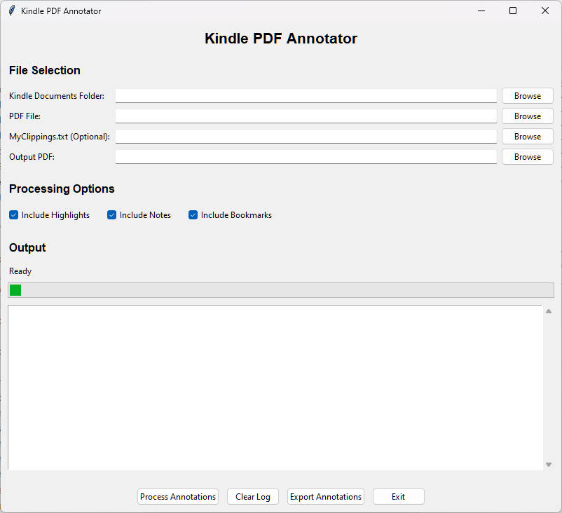
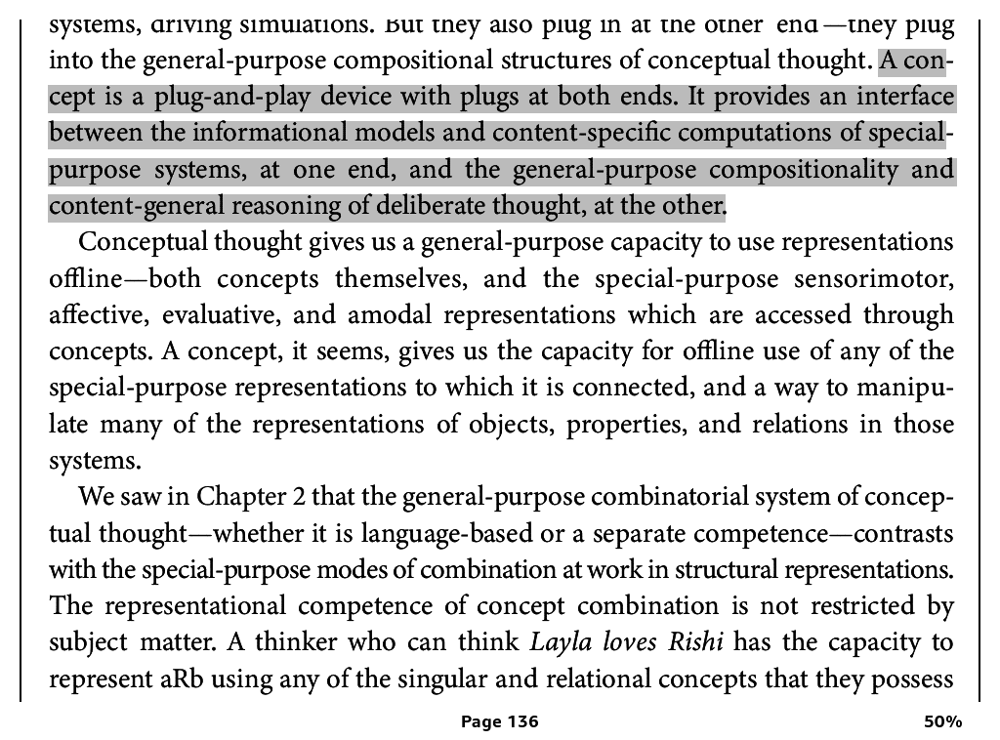
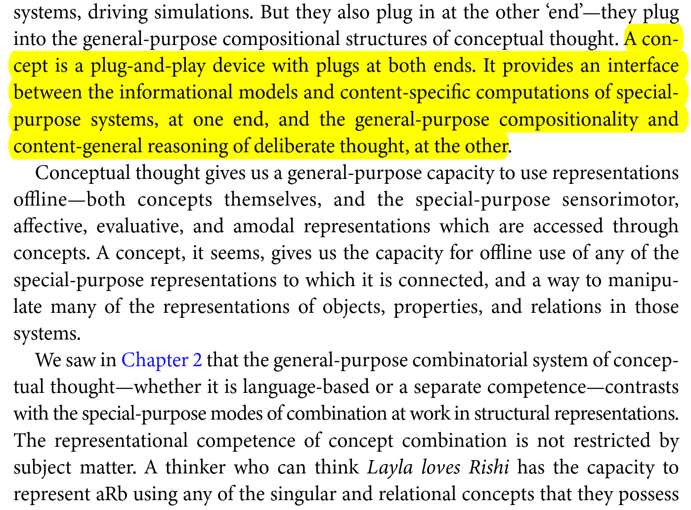

# Kindle PDF Annotator

A Python application to extract Kindle annotations from PDS files and embed them back into the original PDF with pixel-perfect positioning. Kindle devices do not export PDF files with annotations; instead, they create separate proprietary `.pds` and `.pdt` files that contain annotations but are incompatible with standard PDF readers. This tool bridges this gap, allowing you to view your Kindle annotations directly within any PDF viewer.

The application was tested using Kindle Paperwhite (6th generation). Newer devices may require adjustments due to changes in their internal formats, and they are likely to use an internal SQlite database. This repo contains code one can use to calibrate the algorithm if needed (for this, we need a set of files with their annotations from a Kindle device).



## Features

- **Complete Annotation Support**: Extracts and preserves notes, highlights, and bookmarks from Kindle
- **Intelligent Note/Highlight Unification**: Automatically merges notes with their corresponding highlights based on position matching
- **Intelligent Text-Based Matching**: Primary strategy using normalized text search with comprehensive ligature handling
- **Language-Independent Ligature Support**: Handles f-ligatures (fi, fl, ff, ffi, ffl), st-ligatures (st), ae-ligatures (æ, Æ), oe-ligatures (œ, Œ)
- **Fuzzy Matching Fallback**: Uses Levenshtein distance (85% threshold) for long texts with minor variations
- **Precise Amazon Coordinate System**: Converts Kindle coordinates to PDF coordinates with sub-point accuracy
- **Multiple Input Sources**: Processes both PDS files (`.pds`) and `MyClippings.txt` 
- **Accurate Positioning**: Uses precise coordinate system with 0.1-0.5 point precision
- **Correct Highlight Sizing**: Uses actual Kindle annotation dimensions instead of fixed rectangles
- **PDF Navigation Bookmarks**: Creates real PDF bookmarks visible in all PDF viewers
- **GUI and CLI**: Both graphical interface and command-line tool available
- **Comprehensive Testing**: 140 unit tests with 41% code coverage including note unification, fuzzy matching, coordinate conversion, and multi-column layouts

#### Kindle PDF with Annotations



#### Annotated PDF Example 



## Quick Start

### GUI Mode
```bash
python main.py
```

### CLI Mode
```bash
python cli.py --kindle-folder "path/to/book.sdr" --pdf-file "book.pdf" --output "annotated.pdf"
```

## Installation

1. Clone the repository
2. Install dependencies: `pip install -r requirements.txt`
3. Run: `python main.py` (GUI) or `python cli.py --help` (CLI)

## Project Structure

```
kindle-pdf-annotator/
├── main.py                        # GUI application entry point
├── cli.py                         # Command-line interface
├── src/
│   ├── kindle_parser/             # Kindle file parsing modules
│   │   ├── amazon_coordinate_system.py    # Core coordinate conversion (Amazon system)
│   │   ├── fixed_clippings_parser.py      # MyClippings.txt parser (working)
│   │   ├── clippings_parser.py            # Legacy clippings parser (for tests)
│   │   ├── krds_parser.py                 # KRDS file parser (notes, highlights, bookmarks)
│   │   ├── pds_parser.py                  # PDS file parser
│   │   └── pdt_parser.py                  # PDT file parser
│   ├── pdf_processor/             # PDF annotation creation
│   │   ├── amazon_to_pdf_adapter.py       # Convert to PDF annotator format
│   │   ├── annotation_mapper.py           # Legacy coordinate mapping
│   │   ├── column_aware_highlighting.py   # Multi-column layout support
│   │   └── pdf_annotator.py               # PDF annotation creation
│   ├── gui/                       # GUI components
│   │   └── main_window.py                 # Main application window
│   └── utils/                     # Utility modules
│       ├── file_utils.py                  # File handling utilities
│       └── location_encoder.py            # Location encoding utilities
├── tests/                         # Unit tests (comprehensive coverage)
│   ├── test_krds_parser.py                # KRDS parser tests
│   ├── test_page_9_highlights.py          # Core functionality test
│   ├── test_two_column_pdf.py             # Multi-column and bookmark tests
│   ├── test_multi_line_highlight.py       # Multi-line annotation tests
│   ├── test_snake_highlight.py            # Complex highlight tests
│   └── test_parsers.py                    # Legacy parser tests
├── scripts/                       # Development and debugging tools
│   ├── diagnose_imports.py               # Import diagnostics
│   ├── dump_pdf_tokens.py               # PDF content analysis
│   ├── find_content_in_pdf.py           # PDF text search
│   └── inspect_norm.py                   # Coordinate normalization
├── examples/sample_data/          # Sample Kindle files for testing
└── LICENSE                        # GPL v3 license
```

## Usage

### GUI Application
1. Launch: `python main.py`
2. Select Kindle `.sdr` folder (contains PDS and PDT files)
3. Choose PDF file to annotate
4. Optional: Select MyClippings.txt file
5. Process and save annotated PDF

### Command Line
```bash
# Basic usage
python cli.py --kindle-folder "book.sdr" --pdf-file "book.pdf" --output "result.pdf"

# With MyClippings.txt and JSON export
python cli.py --kindle-folder "book.sdr" --pdf-file "book.pdf" --output "result.pdf" \
              --clippings "MyClippings.txt" --export-json "annotations.json" --verbose
```

## Coordinate System

The tool uses a **validated coordinate conversion formula** for placing annotations:

- **Formula**: `PDF_points = (KRDS_units / 100) × 72`
- **Accuracy**: Median error of 10.94 pts (0.15 inches) validated on 346 real highlights
- **CropBox Support**: Automatically handles cropped PDFs by subtracting crop offsets
- **Units**: KRDS uses hundredths of an inch (100 = 1 inch), PDF uses points (72 = 1 inch)

This formula was empirically validated against production-annotated PDFs and outperforms alternative coordinate systems by 26x. For technical details, see `COORDINATE_SYSTEM.md`.

## Technical Details

- **Note/Highlight Unification**: Automatically merges notes with their corresponding highlights based on position matching
  - Matches notes at highlight START or END positions (5pt tolerance)
  - Unified annotations render as highlights with note content
  - Preserves both highlight text and note content in PDF
- **Text-Based Matching**: Primary annotation strategy using normalized full-page text extraction
- **Ligature Normalization**: Strips all ligatures to first character (fi→f, æ→a, œ→o, st→s) matching Kindle's `My Clippings.txt` behavior
- **Text Normalization Pipeline**:
  1. Ligature stripping (all common types)
  2. Hyphenation removal at line breaks
  3. Whitespace normalization (newlines → spaces)
  4. Period normalization (adds space after periods before capitals)
- **Fuzzy Matching**: Levenshtein distance with sliding window for texts >50 characters (85% similarity threshold)
- **Coordinate System**: Uses Amazon's inches×100 encoding with linear mapping as fallback
- **Positioning Accuracy**: 0.1-0.5 point precision (sub-millimeter level)
- **Highlight Sizing**: Extracts actual width/height from Kindle position data
- **Multi-line Highlight Support**: Correctly handles highlights spanning multiple lines with proper quad detection

## Testing

The project includes **138 comprehensive unit tests** covering:
- Note/highlight unification (start/end position matching, tolerance validation)
- Coordinate system conversion and CropBox handling
- KRDS parser functionality
- Text-based matching with ligature normalization
- Fuzzy matching with Levenshtein distance
- Multi-line and multi-column highlight support
- Complex "snake" highlight patterns

```bash
# Run all tests (138 tests)
python -m pytest tests/ -v

# Run core functionality tests
python -m pytest tests/test_unified_note_rendering.py tests/test_note_highlight_unification.py tests/test_cropbox_coordinate_conversion.py -v

# Test specific functionality
python tests/test_page_9_highlights.py
python tests/test_krds_parser.py

# Test ligature handling and fuzzy matching
python -m pytest tests/test_fuzzy_ligature_matching.py -v -s

# Test note/highlight unification
python -m pytest tests/test_unified_note_rendering.py -v

# Test complex highlight patterns
python -m pytest tests/test_snake_highlight.py -v
```

## License

GPL v3 - This project is inspired by and uses code from the GPL-licensed Kindle annotation research by John Howell (see https://github.com/K-R-D-S/KRDS) and must be distributed under GPL terms.

## Requirements

- Python 3.8+
- PyMuPDF (fitz) for PDF processing
- tkinter for GUI (included with Python)
- See `requirements.txt` for complete dependencies